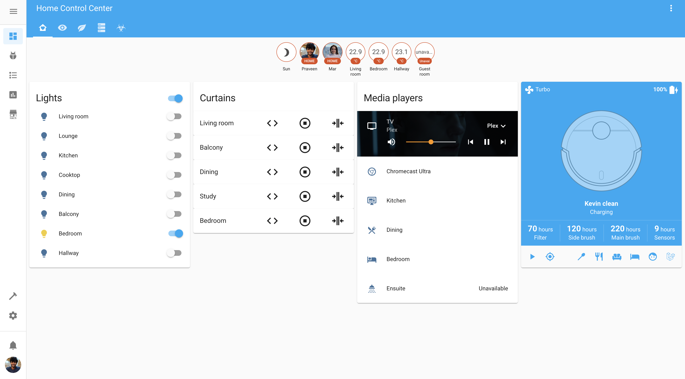
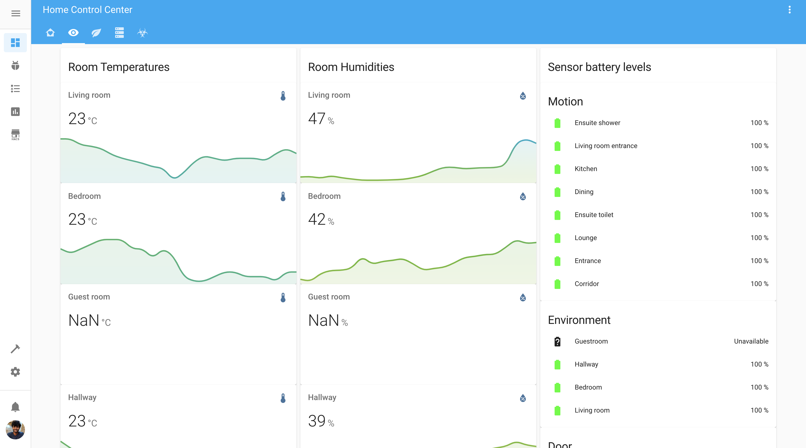
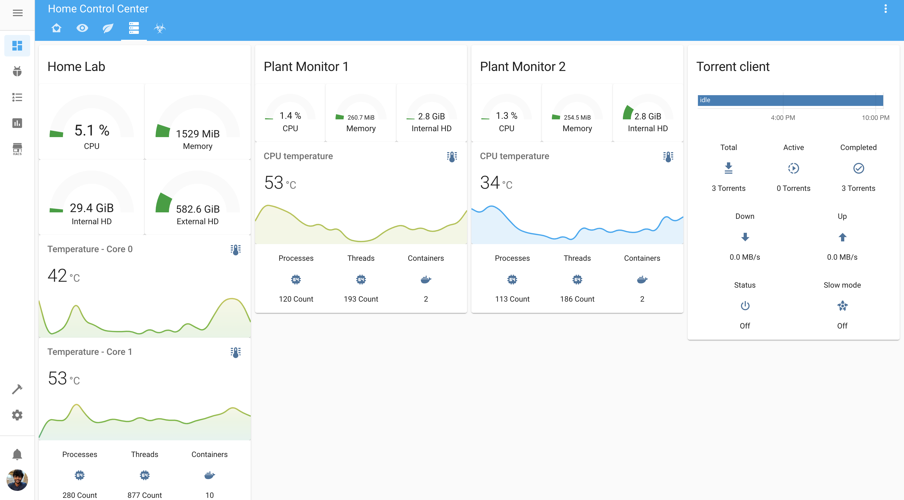

# Home Assistant
Pictures speak a 1000 words. So, let's start with those.

# Hardware
Lot's of connect hardware that accumulated over time on a need by basis.

- Roborock S5 Max robot vaccum
- Philips Hue GU10 Color Spot light
- Philips Hue GU10 White Spot light
- Philips Hue White B22
- Philips Ambilight pus8204 TV
- Xbox One S
- Sonoff Basic Switch
- Aqara Motion Sensors
- Aqara Contact Sensors
- Aqara Environment Sensors
- Google Nest Hub Max
- Google Nest Mini speakers
- Google Home Mini speakers
- JBL Link 10 speaker
- Canon printer
- Zemismart zigbee curtain
- Zemismart Wi-Fi curtain
- Aqara Zigbee curtain
- Xiaomi Plant Sensors - International
- Xiaomi Plant Sensors - Chinese

# Setup
## Secrets
- Make a copy of the `home-assistant/config/secrets.yaml.sample` to `home-assistant/config/secrets.yaml`
- Set each variable in this file

## Android TV integration
This is required for the Android TV integration.
- Install adb `sudo apt install android-tools-adb`
- Authorize adb with the TV `adb connect TV_IP`
- Copy authorized key to config `cp ~/.android/adbkey home-assistant/config/adbkey`
